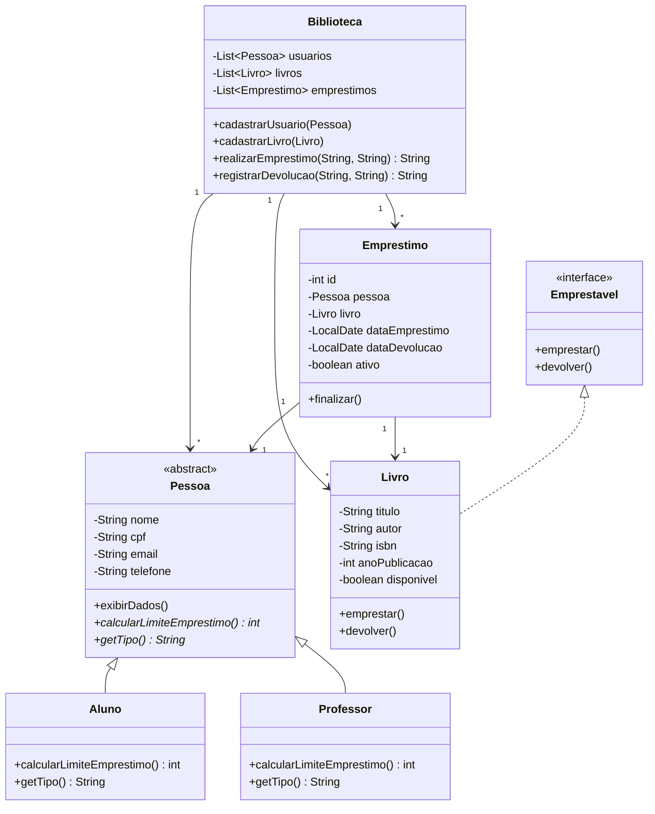

# Biblioteca Inteligente — Documentação Técnica

Sistema de gerenciamento de biblioteca desenvolvido em Java, aplicando
os principais conceitos de Programação Orientada a Objetos (POO):
classes, encapsulamento, herança, classe abstrata, interface,
associação entre classes e persistência de dados.

---

## Sumário

1. [Visão geral](#1-visão-geral)
2. [Requisitos do sistema](#2-requisitos-do-sistema)
3. [Arquitetura do projeto](#3-arquitetura-do-projeto)
4. [Modelagem orientada a objetos](#4-modelagem-orientada-a-objetos)
5. [Regras de negócio](#5-regras-de-negócio)
6. [Persistência de dados](#6-persistência-de-dados)
7. [Como compilar e executar](#7-como-compilar-e-executar)
8. [Manual de uso (menu)](#8-manual-de-uso-menu)
9. [Validações de entrada](#9-validações-de-entrada)
10. [Limitações conhecidas e melhorias futuras](#10-limitações-conhecidas-e-melhorias-futuras)
11. [Glossário de POO usado no projeto](#11-glossário-de-poo-usado-no-projeto)

---

## 1. Visão geral

**Nome do sistema:** Biblioteca Inteligente

**Objetivo:** permitir o cadastro, consulta e gerenciamento de livros,
usuários (alunos e professores) e empréstimos de uma biblioteca, por
meio de um menu interativo em linha de comando.

**Tecnologia:** Java puro (sem frameworks externos), usando apenas
recursos da biblioteca padrão (`java.util`, `java.time`, `java.io`).

---

## 2. Requisitos do sistema

### 2.1 Requisitos funcionais

| Código | Descrição                                                        | Status |
| ------ | ----------------------------------------------------------------- | ------ |
| RF01   | Cadastrar usuários (nome, CPF, e-mail, telefone)                  | ✅ Implementado |
| RF02   | Exibir todos os usuários cadastrados                               | ✅ Implementado |
| RF03   | Cadastrar livros (título, autor, ISBN, ano de publicação)          | ✅ Implementado |
| RF04   | Listar todos os livros cadastrados                                  | ✅ Implementado |
| RF05   | Realizar empréstimos de livros para usuários                       | ✅ Implementado |
| RF06   | Registrar devoluções                                                | ✅ Implementado |
| RF07   | Exibir os empréstimos ativos                                        | ✅ Implementado |
| RF08   | Armazenar dados em arquivo/banco de dados                           | ✅ Implementado (arquivo) — caminho para banco em `bonus-banco-de-dados/` |

### 2.2 Requisitos não funcionais

| Código | Descrição                                          | Onde é atendido |
| ------ | ---------------------------------------------------- | ---------------- |
| RNF01  | Interface interativa via menu                         | `Main.java`, laço principal com `Scanner` |
| RNF02  | Desenvolvido com Programação Orientada a Objetos       | Todo o projeto (ver seção 4) |
| RNF03  | Mensagens amigáveis ao usuário                          | Textos de retorno em `Biblioteca.java` e `Main.java` |
| RNF04  | Validação de entradas incorretas                        | `Validador.java` + laços de releitura em `Main.java` |

---

## 3. Arquitetura do projeto

O projeto segue uma separação simples em camadas, cada uma com uma
responsabilidade única:

```
src/com/biblioteca/
├── Main.java              → camada de apresentação (menu, leitura do teclado)
├── model/                 → entidades do domínio (o "o quê" do sistema)
│   ├── Pessoa.java
│   ├── Aluno.java
│   ├── Professor.java
│   ├── Emprestavel.java
│   ├── Livro.java
│   └── Emprestimo.java
├── service/                → regras de negócio (o "como" do sistema)
│   └── Biblioteca.java
├── persistence/            → gravação e leitura em disco
│   ├── Persistencia.java
│   └── DadosBiblioteca.java
└── util/                    → utilidades genéricas
    └── Validador.java

bonus-banco-de-dados/         → material de referência para evoluir a
                                 persistência de arquivo para MySQL/PostgreSQL
```

**Fluxo de dependência:** `Main` depende de `service` e `persistence`;
`service` e `persistence` dependem de `model`; `model` não depende de
nada além da biblioteca padrão do Java. Isso evita acoplamento
desnecessário — por exemplo, trocar a forma de persistência (arquivo
por banco de dados) não exige mudar nada nas classes de `model`.

---

## 4. Modelagem orientada a objetos

### 4.1 Diagrama de classes



### 4.2 Conceitos de POO aplicados

| Conceito             | Onde está no código                                                        |
| ---------------------- | ----------------------------------------------------------------------------|
| Encapsulamento          | Todos os atributos de `Pessoa`, `Livro` e `Emprestimo` são `private`, acessados via getters/setters |
| Classe abstrata         | `Pessoa`, com o método abstrato `calcularLimiteEmprestimo()`               |
| Herança                 | `Aluno extends Pessoa` e `Professor extends Pessoa`                          |
| Polimorfismo            | `Biblioteca.realizarEmprestimo()` chama `pessoa.calcularLimiteEmprestimo()` sem saber se é Aluno ou Professor |
| Interface                | `Emprestavel` (`emprestar()`, `devolver()`)                                  |
| Implementação de interface | `Livro implements Emprestavel`                                             |
| Associação entre classes | `Emprestimo` guarda uma referência a `Pessoa` e a `Livro`                    |
| Composição/Agregação    | `Biblioteca` mantém listas de `Pessoa`, `Livro` e `Emprestimo`               |

### 4.3 Descrição das classes

**`Pessoa` (abstrata)** — base comum a qualquer usuário da biblioteca.
Guarda dados pessoais e define o contrato `calcularLimiteEmprestimo()`,
que cada subclasse implementa à sua maneira.

**`Aluno`** — limite fixo de **3** livros emprestados simultaneamente.

**`Professor`** — limite fixo de **10** livros emprestados
simultaneamente.

**`Emprestavel`** — interface que descreve qualquer item que possa ser
emprestado e devolvido. Hoje só `Livro` implementa essa interface, mas
o desenho permite estender o sistema no futuro (ex.: revistas, mídias)
sem alterar `Biblioteca` ou `Emprestimo`.

**`Livro`** — representa um exemplar do acervo. Controla seu próprio
estado de disponibilidade através dos métodos `emprestar()` e
`devolver()`.

**`Emprestimo`** — representa a transação de empréstimo: associa uma
`Pessoa` a um `Livro`, com data de retirada, data de devolução (quando
houver) e um indicador `ativo`.

**`Biblioteca`** (camada `service`) — orquestra tudo: mantém as listas
de usuários, livros e empréstimos, e concentra as regras de negócio
(ver seção 5).

---

## 5. Regras de negócio

- Um **Aluno** pode ter no máximo **3** empréstimos ativos ao mesmo tempo.
- Um **Professor** pode ter no máximo **10** empréstimos ativos ao mesmo tempo.
- Um livro só pode ser emprestado se estiver **disponível**
  (`disponivel == true`).
- Não é permitido cadastrar dois usuários com o mesmo **CPF**.
- Não é permitido cadastrar dois livros com o mesmo **ISBN**.
- A devolução só é aceita se existir um empréstimo **ativo** com o
  mesmo ISBN e o mesmo CPF informados.
- Ao devolver, o livro volta a ficar disponível e o empréstimo é
  marcado como finalizado, com a data de devolução registrada.

Toda essa lógica está concentrada na classe `Biblioteca`
(`realizarEmprestimo` e `registrarDevolucao`), para que `Main` cuide
apenas da interação com o usuário, sem decidir regras de negócio.

---

## 6. Persistência de dados

Por padrão, o sistema grava o estado completo (usuários, livros e
empréstimos) em um único arquivo binário, `biblioteca.dat`, usando
serialização nativa do Java (`ObjectOutputStream`/`ObjectInputStream`).

- A gravação acontece ao escolher a opção **9 - Salvar dados** ou ao
  **sair** do programa (opção 0).
- A leitura acontece automaticamente ao iniciar o programa, se o
  arquivo já existir.

Essa abordagem atende ao RF08 sem exigir nenhuma instalação externa.
Para quem quiser ir além e usar um banco de dados relacional de
verdade (MySQL ou PostgreSQL) — geralmente valendo ponto extra na
avaliação — a pasta `bonus-banco-de-dados/` contém:

- `schema.sql` — script de criação das tabelas `usuarios`, `livros` e
  `emprestimos`, já com as chaves estrangeiras correspondentes à
  associação `Emprestimo → Pessoa/Livro`.
- `ConexaoBD.java` — classe de exemplo para abrir conexão JDBC.
- `README-BANCO-DE-DADOS.md` — passo a passo de como conectar tudo.

---

## 7. Como compilar e executar

A partir da pasta `biblioteca-inteligente`:

```bash
# compilar
javac -cp "lib\postgresql-42.7.11.jar" -d bin $(Get-ChildItem -Recurse src -Filter *.java | % {$_.FullName})

# executar
java -cp "bin;lib\postgresql-42.7.11.jar" com.biblioteca.Main
```

Em uma IDE (IntelliJ, Eclipse, NetBeans ou VS Code com extensão Java),
basta abrir a pasta `src` como raiz do projeto e executar `Main.java`.

O arquivo `biblioteca.dat` é criado na pasta onde o programa é
executado — não precisa configurar nada antes da primeira execução.

---

## 8. Manual de uso (menu)

```
----------- MENU PRINCIPAL -----------
1 - Cadastrar usuário
2 - Listar usuários
3 - Cadastrar livro
4 - Listar livros
5 - Realizar empréstimo
6 - Registrar devolução
7 - Listar empréstimos ativos
8 - Listar histórico de empréstimos
9 - Salvar dados em arquivo
0 - Sair
---------------------------------------
```

| Opção | O que acontece |
| ----- | ---------------- |
| 1 | Pede nome, CPF, e-mail, telefone e tipo (Aluno/Professor); recusa CPF duplicado |
| 2 | Lista todos os usuários, com seus dados e limite de empréstimo |
| 3 | Pede título, autor, ISBN e ano; recusa ISBN duplicado |
| 4 | Lista todos os livros, mostrando se estão disponíveis ou emprestados |
| 5 | Pede CPF e ISBN; valida disponibilidade e limite antes de confirmar |
| 6 | Pede ISBN e CPF; localiza o empréstimo ativo correspondente e o encerra |
| 7 | Mostra somente os empréstimos em andamento |
| 8 | Mostra todos os empréstimos já registrados (ativos e finalizados) |
| 9 | Grava o estado atual em `biblioteca.dat` sem encerrar o programa |
| 0 | Salva e encerra o programa |

**Exemplo de fluxo completo:** cadastrar um aluno (opção 1) → cadastrar
um livro (opção 3) → realizar o empréstimo entre os dois (opção 5) →
conferir em empréstimos ativos (opção 7) → registrar a devolução
(opção 6) → sair salvando os dados (opção 0).

---

## 9. Validações de entrada

Implementadas em `Validador.java` e aplicadas nos métodos de leitura
de `Main.java` (`lerCpf`, `lerEmail`, `lerAno`, `lerTexto`,
`lerInteiro`):

- **Texto obrigatório:** nenhum campo de texto pode ficar vazio.
- **CPF:** deve conter exatamente 11 dígitos numéricos (a formatação,
  se houver, é removida automaticamente).
- **E-mail:** precisa seguir o formato `algo@dominio.algumacoisa`.
- **Ano de publicação:** precisa ser um número entre 1 e o ano atual.
- **Números inteiros (menu, ano):** entradas não numéricas são
  rejeitadas com uma mensagem clara, sem derrubar o programa.

Em todos os casos, o programa **repete a pergunta** até receber uma
resposta válida, em vez de travar ou aceitar dados incorretos.

---

## 10. Limitações conhecidas e melhorias futuras

O projeto foi desenhado para atender integralmente aos requisitos da
avaliação, mas existem pontos que podem ser evoluídos:

- **Sem interface gráfica** — hoje é 100% linha de comando; uma
  evolução natural seria uma versão com Swing ou JavaFX.
- **Sem edição/exclusão de cadastros** — só é possível cadastrar e
  listar; remover ou editar um usuário/livro exigiria novos métodos
  em `Biblioteca`.
- **Persistência simples** — o arquivo `biblioteca.dat` é binário e
  não pode ser lido/editado fora do programa; a pasta
  `persistence/` mostra o caminho para um banco relacional.
- **Sem testes automatizados** — as regras de negócio poderiam ganhar
  testes unitários (JUnit) para `Biblioteca`, especialmente os
  cenários de limite de empréstimo e disponibilidade de livro.

---

## 11. Glossário de POO usado no projeto

| Termo | Definição rápida |
| ----- | ------------------- |
| Classe abstrata | Classe que não pode ser instanciada diretamente; serve de base para outras classes e pode conter métodos sem implementação (abstratos) |
| Método abstrato | Método declarado sem corpo; obriga as subclasses a implementá-lo |
| Herança | Mecanismo pelo qual uma classe (subclasse) reaproveita atributos e métodos de outra (superclasse) usando `extends` |
| Interface | Contrato de métodos sem implementação, que uma classe assume usando `implements` |
| Encapsulamento | Prática de tornar atributos `private` e expor acesso controlado via getters/setters |
| Polimorfismo | Capacidade de um mesmo método se comportar de forma diferente dependendo do objeto real que o chama |
| Associação | Relação em que uma classe guarda uma referência a outra, sem herança entre elas |


* Ultima atualização 25/06/2026